# **Analysis of Design Algorithms Practicals**

> **Complete project README covering every practical in one continuous numbered order**

---

## **Project Snapshot**

This repository collects practical implementations of searching, sorting, divide-and-conquer, greedy methods, dynamic programming, graph algorithms, and backtracking problems.

Each practical below includes:
- **Aim**
- **Algorithm in 2-3 clear steps**
- **Time complexity**
- **Space complexity**
- **Important function code only**
- **Three use cases**
- **Graph image**

---

## **Contents**
- [Practical 1: Bubble Sort](#practical-1-bubble-sort)
- [Practical 2: Consecutive Element Check](#practical-2-consecutive-element-check)
- [Practical 3: Duplicate Detection](#practical-3-duplicate-detection)
- [Practical 4: Horner's Rule](#practical-4-horner-s-rule)
- [Practical 5: Linear Search](#practical-5-linear-search)
- [Practical 6: Permutation Generation](#practical-6-permutation-generation)
- [Practical 7: Power x^n](#practical-7-power-x-n)
- [Practical 8: Selection Sort](#practical-8-selection-sort)
- [Practical 9: Tower of Hanoi](#practical-9-tower-of-hanoi)
- [Practical 10: Velocity Computation](#practical-10-velocity-computation)
- [Practical 11: Binary Search](#practical-11-binary-search)
- [Practical 12: Insertion Sort](#practical-12-insertion-sort)
- [Practical 13: Merge Sort](#practical-13-merge-sort)
- [Practical 14: Quick Sort](#practical-14-quick-sort)
- [Practical 15: Binary Search (Alternative Run)](#practical-15-binary-search-alternative-run)
- [Practical 16: Algorithm Driver](#practical-16-algorithm-driver)
- [Practical 17: Permutation Generation (Alternative Run)](#practical-17-permutation-generation-alternative-run)
- [Practical 18: Quick Sort (Alternative Run)](#practical-18-quick-sort-alternative-run)
- [Practical 19: Convex Hull](#practical-19-convex-hull)
- [Practical 20: 0/1 Knapsack](#practical-20-0-1-knapsack)
- [Practical 21: K-th Smallest](#practical-21-k-th-smallest)
- [Practical 22: Max and Min](#practical-22-max-and-min)
- [Practical 23: Quick Sort (Lab 5)](#practical-23-quick-sort-lab-5)
- [Practical 24: Dijkstra's Algorithm](#practical-24-dijkstra-s-algorithm)
- [Practical 25: Kruskal's Algorithm](#practical-25-kruskal-s-algorithm)
- [Practical 26: Prim's Algorithm](#practical-26-prim-s-algorithm)
- [Practical 27: Stage Identification in a Multistage Graph](#practical-27-stage-identification-in-a-multistage-graph)
- [Practical 28: Multistage Graph Shortest Path](#practical-28-multistage-graph-shortest-path)
- [Practical 29: Matrix Chain Multiplication](#practical-29-matrix-chain-multiplication)
- [Practical 30: All-Pairs Shortest Path](#practical-30-all-pairs-shortest-path)
- [Practical 31: Floyd-Warshall Timing Variant](#practical-31-floyd-warshall-timing-variant)
- [Practical 32: Traveling Salesman Problem](#practical-32-traveling-salesman-problem)
- [Practical 33: Graph Coloring](#practical-33-graph-coloring)
- [Practical 34: Hamiltonian Cycle](#practical-34-hamiltonian-cycle)
- [Practical 35: N-Queens](#practical-35-n-queens)
- [Practical 36: Sum of Subsets](#practical-36-sum-of-subsets)

---

## **Practical 1: Bubble Sort**

**Aim**
Sorts elements by repeatedly swapping adjacent out-of-order pairs.

**Algorithm**
1. Start from the beginning of the array and compare each adjacent pair.
2. Swap the elements whenever they are in the wrong order so larger values move rightward.
3. Repeat the passes until the array becomes completely sorted.

**Time Complexity**
- `O(n^2) average/worst, O(n) best`

**Space Complexity**
- `O(1)`

**Important Function Code**
```cpp
void swapIndex(vector<int> &a, int i, int j) {
    int t = a[i];
    a[i] = a[j];
    a[j] = t;
}

void bb(vector<int> &a, int i) {
    if (i >= a.size()) return;

    for (int j = 1; j < a.size() - i + 1; j++) {
        if (a[j - 1] > a[j]) swapIndex(a, j, j - 1);
    }

    bb(a, i + 1);
}

double getTime(vector<int> a) {
    auto t1 = chrono::high_resolution_clock::now();

    bb(a, 1);

    auto t2 = chrono::high_resolution_clock::now();

    return chrono::duration<double, milli>(t2 - t1).count();
}
```

**Use Cases**
- Educational demos for basic sorting
- Small nearly sorted datasets
- Understanding stability and swap-based sorting

**Graph Image**
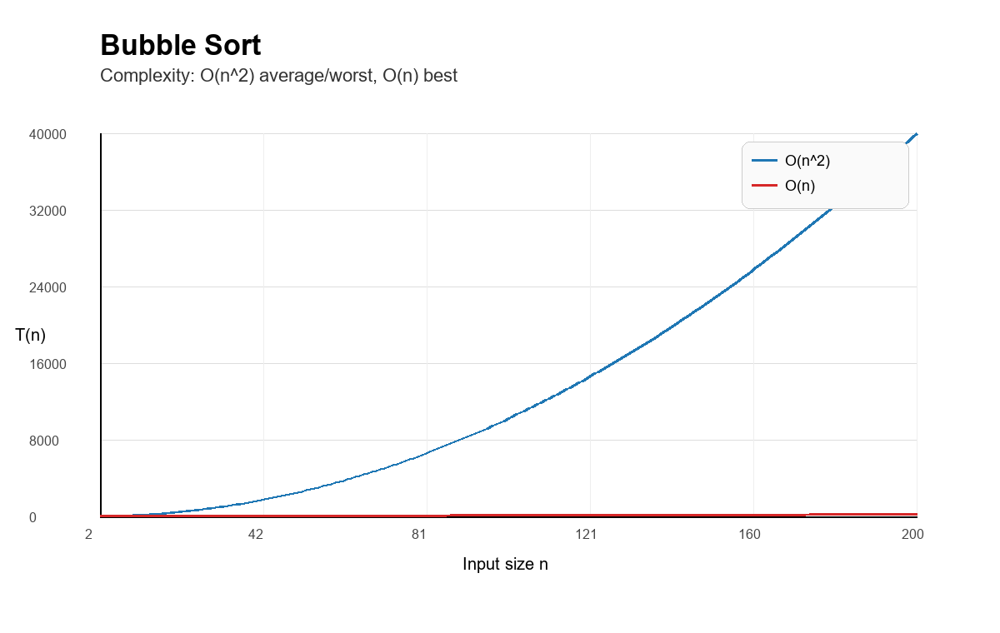

---

## **Practical 2: Consecutive Element Check**

**Aim**
Checks whether array elements form a consecutive sequence.

**Algorithm**
1. Arrange the values in sorted order so neighboring numbers can be compared easily.
2. Check whether every adjacent pair differs by exactly one.
3. If all differences are valid, conclude that the sequence is consecutive.

**Time Complexity**
- `O(n log n)`

**Space Complexity**
- `O(1) auxiliary or O(n) depending on sort implementation`

**Important Function Code**
```cpp
int findMis(vector<int> &nums) {
    int prev = nums[0];

    for (int i = 1; i < nums.size(); i++) {
        if ((prev & 1) == (nums[i] & 1)) {
            if ((prev & 1) == 0) {
                return prev | 1;
            } else {
                return nums[i] & ~1;
            }
        }
        prev = nums[i];
    }

    return -1;
}
```

**Use Cases**
- Detecting missing values in ranges
- Validating sequence-based puzzle inputs
- Preprocessing integer sets before analytics

**Graph Image**
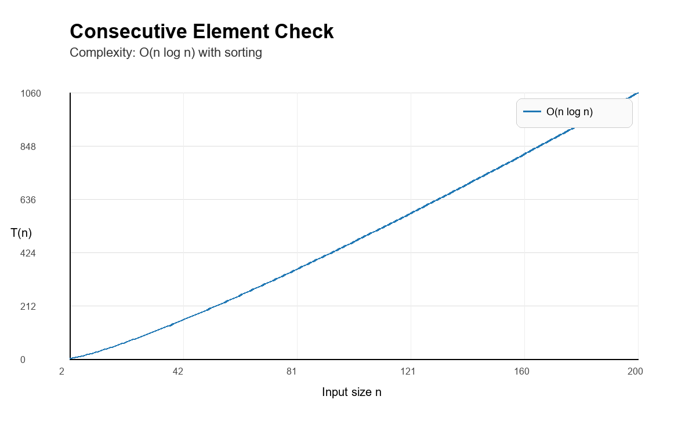

---

## **Practical 3: Duplicate Detection**

**Aim**
Detects duplicate elements in a list or array.

**Algorithm**
1. Traverse the collection element by element.
2. Store each visited value in a lookup structure such as a hash set.
3. Stop as soon as a repeated value is encountered, otherwise finish with no duplicates found.

**Time Complexity**
- `O(n) with hashing`

**Space Complexity**
- `O(n)`

**Important Function Code**
```cpp
int dup(vector<int> &arr) {
    int d = -1;
    int index = arr.size();

    for (int i = 0; i < index; i++) {
        for (int j = i + 1; j < index; j++) {
            if (arr[i] == arr[j]) {
                d = arr[i];
                index = j;
                break;
            }
        }
    }
    return d;
}

int dup2(vector<int> &arr) {
    int d = -1;
    int n = arr.size() / 2;

    for (int i = 0; i < n; i++) {
        int t = arr[n - i];
        for (int j = 0; j < n - i; j++) {
            if (t == arr[j]) {
                d = t;
                break;
            }
        }
    }
    return d;
}
```

**Use Cases**
- Input validation in forms and uploads
- Checking repeated IDs in datasets
- Removing redundant values before processing

**Graph Image**
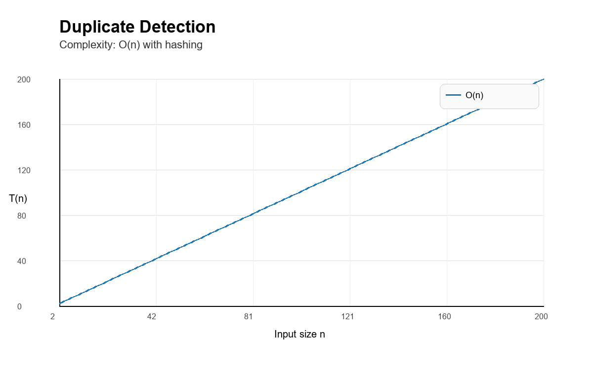

---

## **Practical 4: Horner's Rule**

**Aim**
Evaluates a polynomial efficiently using nested multiplication.

**Algorithm**
1. Begin with the leading coefficient as the running result.
2. For each next coefficient, multiply the running result by x and add the coefficient.
3. Continue until every term is processed to obtain the final polynomial value.

**Time Complexity**
- `O(n)`

**Space Complexity**
- `O(1)`

**Important Function Code**
```cpp
string HR(int i, vector<int> &arr) {
    if (i == arr.size() - 1) return to_string(arr[i]);
    return to_string(arr[i]) + " + x(" + HR(i + 1, arr) + ")";
}
```

**Use Cases**
- Fast polynomial evaluation
- Computer graphics interpolation formulas
- Scientific and engineering calculations

**Graph Image**


---

## **Practical 5: Linear Search**

**Aim**
Finds a target by sequentially scanning elements.

**Algorithm**
1. Start from the first element and compare it with the target.
2. Move through the collection one item at a time until the target is found.
3. If the end is reached without a match, report that the target is absent.

**Time Complexity**
- `O(n)`

**Space Complexity**
- `O(1)`

**Important Function Code**
```cpp
int LS(vector<int> &arr, int target, int i) {
    if (i == arr.size()) return -1;
    if (arr[i] == target) return i;
    return LS(arr, target, i + 1);
}

double getTime(vector<int> arr, int target) {
    auto t1 = chrono::high_resolution_clock::now();

    int ans = LS(arr, target, 0);

    auto t2 = chrono::high_resolution_clock::now();

    return chrono::duration<double, milli>(t2 - t1).count();
}
```

**Use Cases**
- Searching unsorted data
- Very small collections
- Streaming data where indexing is unavailable

**Graph Image**
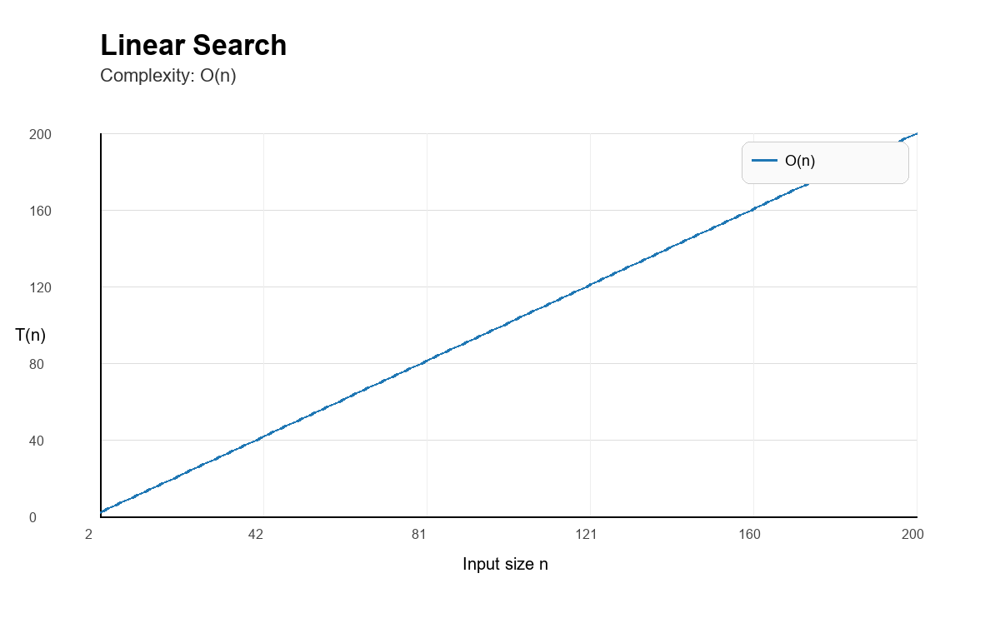

---

## **Practical 6: Permutation Generation**

**Aim**
Generates all permutations using recursion and swapping.

**Algorithm**
1. Fix one position in the array and try every possible element there.
2. Recursively generate permutations for the remaining suffix.
3. Backtrack after each recursive call so other arrangements can be explored.

**Time Complexity**
- `O(n * n!)`

**Space Complexity**
- `O(n) recursion stack`

**Important Function Code**
```cpp
void swapChar(int i, int j, vector<char> &str) {
    char t = str[i];
    str[i] = str[j];
    str[j] = t;
}

void perm(vector<char> &str, int i) {
    if (i == str.size()) {
        for (char c : str) cout << c;
        cout << endl;
        return;
    }

    for (int j = i; j < str.size(); j++) {
        swapChar(i, j, str);
        perm(str, i + 1);
        swapChar(i, j, str);
    }
}
```

**Use Cases**
- Arrangement generation problems
- Brute-force search spaces
- Puzzle and scheduling exploration

**Graph Image**


---

## **Practical 7: Power x^n**

**Aim**
Computes x raised to n using fast exponentiation.

**Algorithm**
1. Divide the exponent by two recursively instead of multiplying x repeatedly.
2. Square the partial result to build larger powers efficiently.
3. If the exponent is odd, multiply once more by x to complete the result.

**Time Complexity**
- `O(log n)`

**Space Complexity**
- `O(log n) recursion stack`

**Important Function Code**
```cpp
int powerRec(int x, int n) {
    if (n == 0) return 1;
    if (n < 0) return powerRec(1 / x, -n);

    int half = powerRec(x, n / 2);

    if (n % 2 == 0) return half * half;
    else return half * half * x;
}

int powerRec2(int x, int n) {
    if (n == 0) return 1;
    if (n < 0) return powerRec(1 / x, -n);

    return x * powerRec2(x, n - 1);
}
```

**Use Cases**
- Large power computation
- Modular exponentiation foundations
- Mathematical utility functions

**Graph Image**
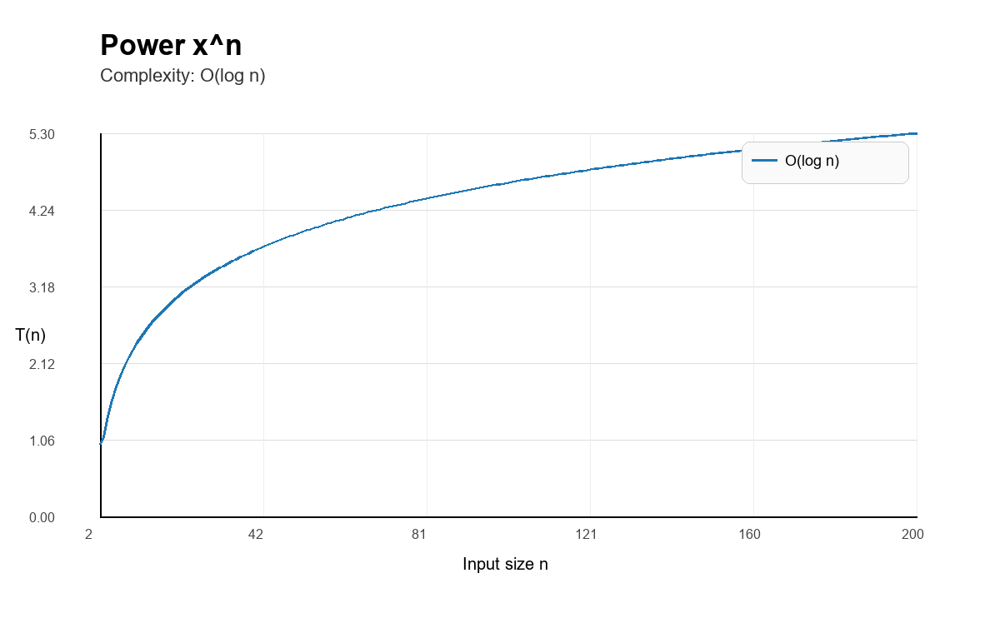

---

## **Practical 8: Selection Sort**

**Aim**
Sorts by repeatedly selecting the minimum element.

**Algorithm**
1. Treat the array as a sorted prefix followed by an unsorted suffix.
2. Find the smallest element in the unsorted suffix.
3. Swap it into the next position of the sorted prefix and repeat.

**Time Complexity**
- `O(n^2)`

**Space Complexity**
- `O(1)`

**Important Function Code**
```cpp
void swapIndex(vector<int> &arr, int i, int j) {
    int t = arr[i];
    arr[i] = arr[j];
    arr[j] = t;
}

int minIndex(vector<int> &arr, int i) {
    int m = i;
    for (int j = i; j < arr.size(); j++) {
        if (arr[m] > arr[j]) m = j;
    }
    return m;
}

void ss(vector<int> &arr, int i) {
    if (i == arr.size()) return;

    int idx = minIndex(arr, i);
    swapIndex(arr, idx, i);

    ss(arr, i + 1);
}

double getTime(vector<int> arr) {
    auto t1 = chrono::high_resolution_clock::now();

    ss(arr, 0);

    auto t2 = chrono::high_resolution_clock::now();

    return chrono::duration<double, milli>(t2 - t1).count();
}
```

**Use Cases**
- Teaching in-place sorting
- Very small datasets
- When swap count should remain low

**Graph Image**
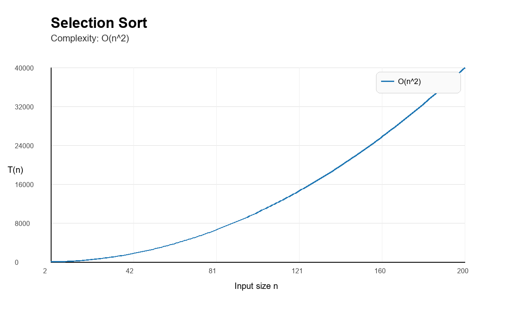

---

## **Practical 9: Tower of Hanoi**

**Aim**
Moves disks between rods while preserving the size rule.

**Algorithm**
1. Move the top n-1 disks from the source rod to the helper rod recursively.
2. Move the largest remaining disk directly to the destination rod.
3. Move the n-1 disks from the helper rod onto the destination rod.

**Time Complexity**
- `O(2^n)`

**Space Complexity**
- `O(n) recursion stack`

**Important Function Code**
```cpp
void TOH(int n, int src, int dest, int ex) {
    if (n == 1) {
        cout << "Move disk from " << src << " to " << dest << endl;
        return;
    }

    TOH(n - 1, src, ex, dest);
    cout << "Move disk from " << src << " to " << dest << endl;
    TOH(n - 1, ex, dest, src);
}
```

**Use Cases**
- Recursion practice
- Classical puzzle simulation
- Demonstrating divide-and-conquer reasoning

**Graph Image**
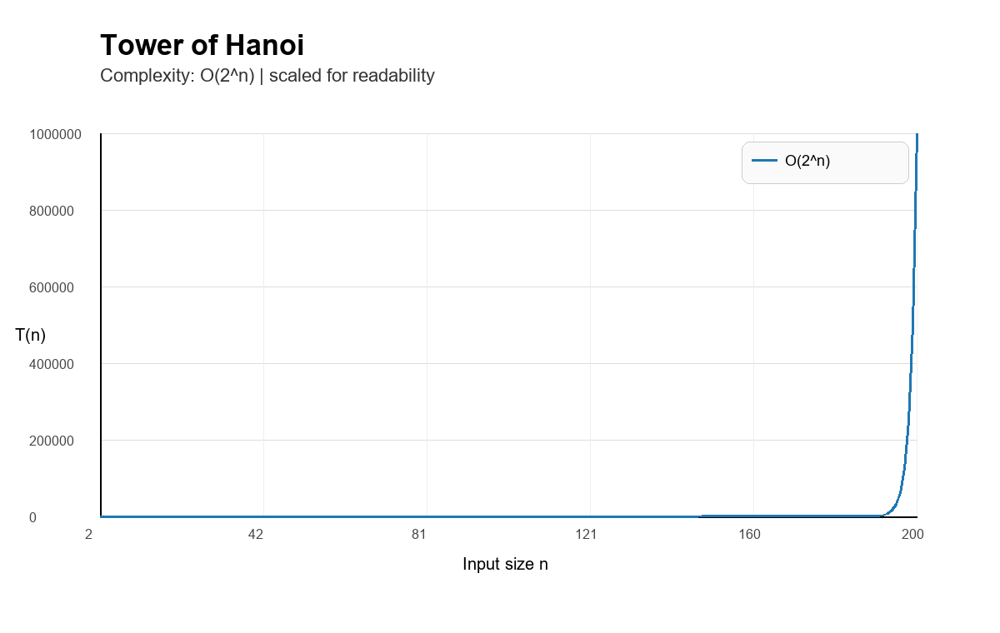

---

## **Practical 10: Velocity Computation**

**Aim**
Computes velocity from input values.

**Algorithm**
1. Read the required physical quantities from input.
2. Apply the velocity formula directly using the given values.
3. Display the computed result.

**Time Complexity**
- `O(1)`

**Space Complexity**
- `O(1)`

**Important Function Code**
```cpp
int tips(double v, int t) {
    if (v >= 1) {
        t++;
        v = v - (0.425 * v);
        return tips(v, t);
    }
    return t;
}
```

**Use Cases**
- Basic physics calculations
- Introductory programming exercises
- Constant-time formula evaluation

**Graph Image**
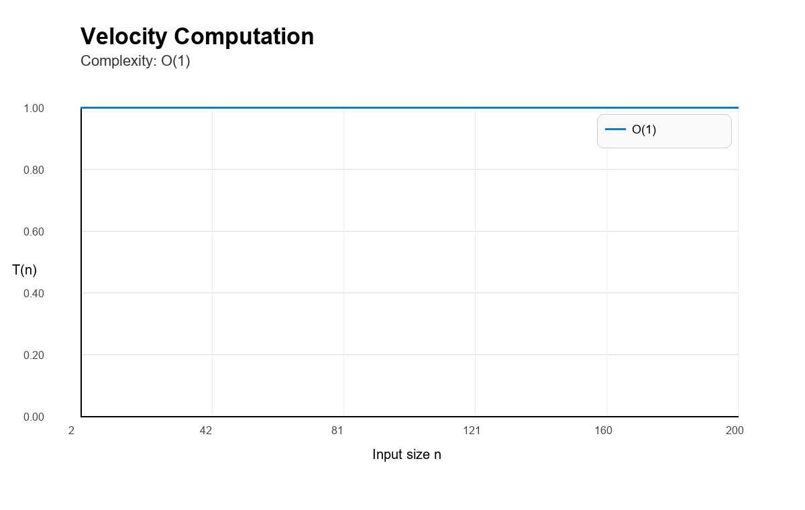

---

## **Practical 11: Binary Search**

**Aim**
Finds an element in sorted data by halving search space.

**Algorithm**
1. Compute the middle index of the current search range.
2. Compare the middle value with the target to decide which half can be discarded.
3. Repeat on the remaining half until the target is found or the range becomes empty.

**Time Complexity**
- `O(log n)`

**Space Complexity**
- `O(log n) recursion stack`

**Important Function Code**
```cpp
int BS(vector<int> &arr, int t, int s, int e) {
    if (e < s) return -1;

    int m = s + (e - s) / 2;

    if (arr[m] == t) return m;
    else if (arr[m] < t) return BS(arr, t, m + 1, e);
    else return BS(arr, t, s, m - 1);
}

double getTime(vector<int> arr, int t) {
    auto t1 = chrono::high_resolution_clock::now();

    BS(arr, t, 0, arr.size() - 1);

    auto t2 = chrono::high_resolution_clock::now();

    return chrono::duration<double, milli>(t2 - t1).count();
}
```

**Use Cases**
- Searching sorted arrays
- Dictionary-like lookup tables
- Fast threshold position queries

**Graph Image**


---

## **Practical 12: Insertion Sort**

**Aim**
Builds a sorted array one element at a time.

**Algorithm**
1. Assume the first part of the array is already sorted.
2. Take the next element and shift larger elements one position to the right.
3. Insert the current element into its correct sorted position and continue.

**Time Complexity**
- `O(n^2) average/worst, O(n) best`

**Space Complexity**
- `O(1)`

**Important Function Code**
```cpp
void IS(vector<int> &arr) {
    for (int i = 1; i < arr.size(); i++) {
        int t = arr[i];
        int j = i - 1;

        while (j >= 0 && arr[j] > t) {
            arr[j + 1] = arr[j];
            j--;
        }

        arr[j + 1] = t;
    }
}

double getTime(vector<int> arr) {
    auto t1 = chrono::high_resolution_clock::now();

    IS(arr);

    auto t2 = chrono::high_resolution_clock::now();

    return chrono::duration<double, milli>(t2 - t1).count();
}
```

**Use Cases**
- Nearly sorted datasets
- Online insertion scenarios
- Educational sorting demonstrations

**Graph Image**
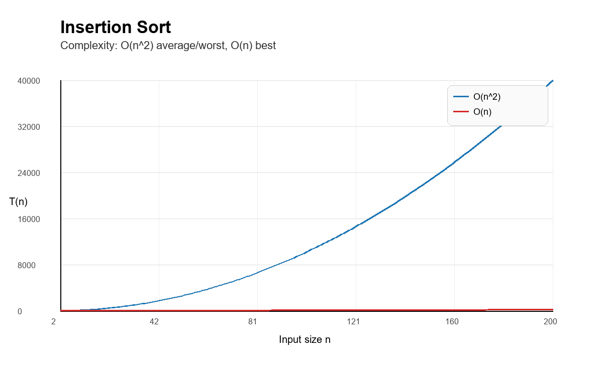

---

## **Practical 13: Merge Sort**

**Aim**
Divides the array, sorts halves, and merges them.

**Algorithm**
1. Split the array into two halves recursively until single-element segments remain.
2. Merge neighboring sorted segments by comparing their front elements.
3. Continue merging upward until the full array is rebuilt in sorted order.

**Time Complexity**
- `O(n log n)`

**Space Complexity**
- `O(n)`

**Important Function Code**
```cpp
void mergeS(vector<int> &arr, int s, int m, int e) {
    int i = s, j = m, k = 0;
    vector<int> mix(e - s);

    while (i < m && j < e) {
        if (arr[i] < arr[j]) mix[k++] = arr[i++];
        else mix[k++] = arr[j++];
    }

    while (i < m) mix[k++] = arr[i++];
    while (j < e) mix[k++] = arr[j++];

    for (int l = 0; l < mix.size(); l++) {
        arr[s + l] = mix[l];
    }
}

void ms(vector<int> &arr, int s, int e) {
    if (e - s <= 1) return;

    int m = s + (e - s) / 2;

    ms(arr, s, m);
    ms(arr, m, e);

    mergeS(arr, s, m, e);
}

double getTime(vector<int> arr) {
    auto t1 = chrono::high_resolution_clock::now();

    ms(arr, 0, arr.size());

    auto t2 = chrono::high_resolution_clock::now();

    return chrono::duration<double, milli>(t2 - t1).count();
}
```

**Use Cases**
- Large dataset sorting
- Stable sorting requirements
- External sorting foundations

**Graph Image**
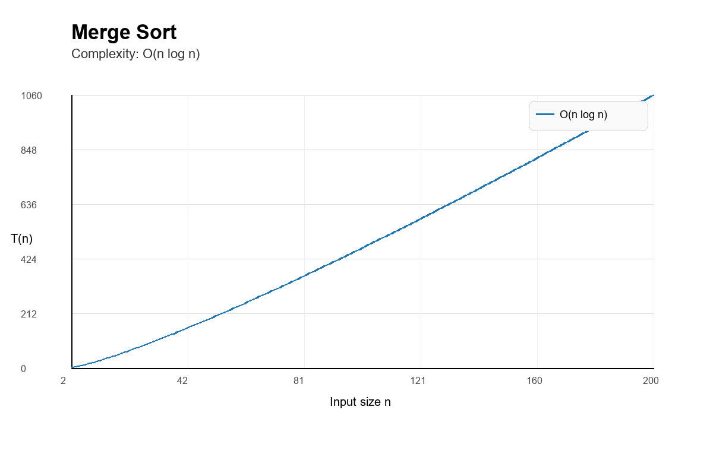

---

## **Practical 14: Quick Sort**

**Aim**
Sorts by partitioning around a pivot recursively.

**Algorithm**
1. Choose a pivot and rearrange the array so smaller elements move to one side and larger elements to the other.
2. Place the pivot in its final sorted position after partitioning.
3. Recursively apply the same process to the left and right partitions.

**Time Complexity**
- `O(n log n) average, O(n^2) worst`

**Space Complexity**
- `O(log n) average recursion stack`

**Important Function Code**
```cpp
void swapIndex(vector<int> &arr, int l, int h) {
    int t = arr[l];
    arr[l] = arr[h];
    arr[h] = t;
}

int partition(vector<int> &arr, int s, int e) {
    int m = s + (e - s) / 2;
    int pivot = arr[m];

    int index = s;
    for (int i = s; i <= e; i++) {
        if (arr[i] < pivot) index++;
    }

    swapIndex(arr, m, index);

    int l = s, h = e;

    while (l < index && h > index) {
        while (arr[l] < pivot) l++;
        while (arr[h] > pivot) h--;

        if (l < index && h > index) {
            swapIndex(arr, l, h);
            l++;
            h--;
        }
    }

    return index;
}

void qs(vector<int> &arr, int s, int e) {
    if (s < e) {
        int j = partition(arr, s, e);
        qs(arr, s, j - 1);
        qs(arr, j + 1, e);
    }
}

double getTime(vector<int> arr) {
    auto t1 = chrono::high_resolution_clock::now();

    qs(arr, 0, arr.size() - 1);

    auto t2 = chrono::high_resolution_clock::now();

    return chrono::duration<double, milli>(t2 - t1).count();
}
```

**Use Cases**
- General-purpose fast sorting
- In-memory array sorting
- Partition-based ordering tasks

**Graph Image**


---

## **Practical 15: Binary Search (Alternative Run)**

**Aim**
Runs the same binary-search idea with a separate lab implementation.

**Algorithm**
1. Sort or assume sorted input before searching.
2. Check the middle position to eliminate half of the remaining range.
3. Repeat until the key is found or no valid range remains.

**Time Complexity**
- `O(log n)`

**Space Complexity**
- `O(log n) recursion stack`

**Important Function Code**
```cpp
int bs(vector<int> &arr, int target, int s, int e) {
    if (s > e) return -1;

    int m = s + (e - s) / 3;

    if (arr[m] == target) return m;
    else if (arr[m] < target) return bs(arr, target, m + 1, e);
    else return bs(arr, target, s, m - 1);
}
```

**Use Cases**
- Cross-checking binary search behavior
- Lab-wise performance comparison
- Practicing recursive search structure

**Graph Image**
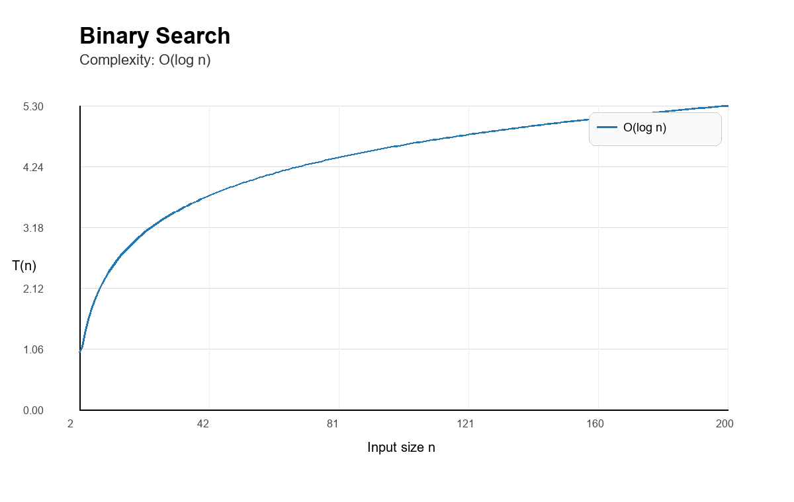

---

## **Practical 16: Algorithm Driver**

**Aim**
Runs and demonstrates selected algorithm logic.

**Algorithm**
1. Start the program and print a simple greeting message.
2. Iterate through a small range of values to demonstrate control flow.
3. Display each generated output on the console.

**Time Complexity**
- `Depends on invoked logic`

**Space Complexity**
- `O(1)`

**Important Function Code**
```cpp
// No standalone helper function is available after removing int main().
```

**Use Cases**
- Starter template files
- Driver program flow demonstration
- Basic console I/O practice

**Graph Image**
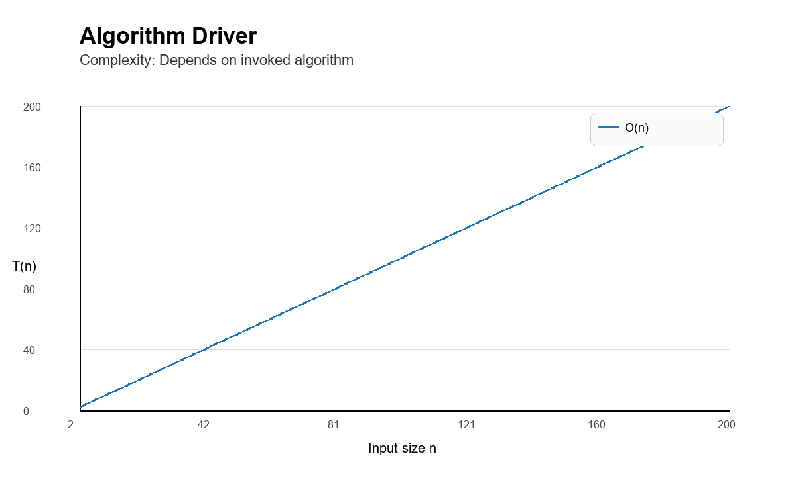

---

## **Practical 17: Permutation Generation (Alternative Run)**

**Aim**
Generates all permutations through backtracking.

**Algorithm**
1. Pick an element for the current position.
2. Recursively arrange the remaining elements.
3. Undo the choice after each call so new arrangements can be tested.

**Time Complexity**
- `O(n * n!)`

**Space Complexity**
- `O(n) recursion stack`

**Important Function Code**
```cpp
void swapChar(int i, int j, vector<char> &arr) {
    char t = arr[i];
    arr[i] = arr[j];
    arr[j] = t;
}

void perm(vector<char> &arr, int i) {
    if (i == arr.size()) {
        for (char c : arr) cout << c;
        cout << endl;
        return;
    }

    for (int j = i; j < arr.size(); j++) {
        swapChar(i, j, arr);
        perm(arr, i + 1);
        swapChar(i, j, arr);
    }
}
```

**Use Cases**
- Generating all orderings
- Backtracking practice
- Testing permutation-based solutions

**Graph Image**
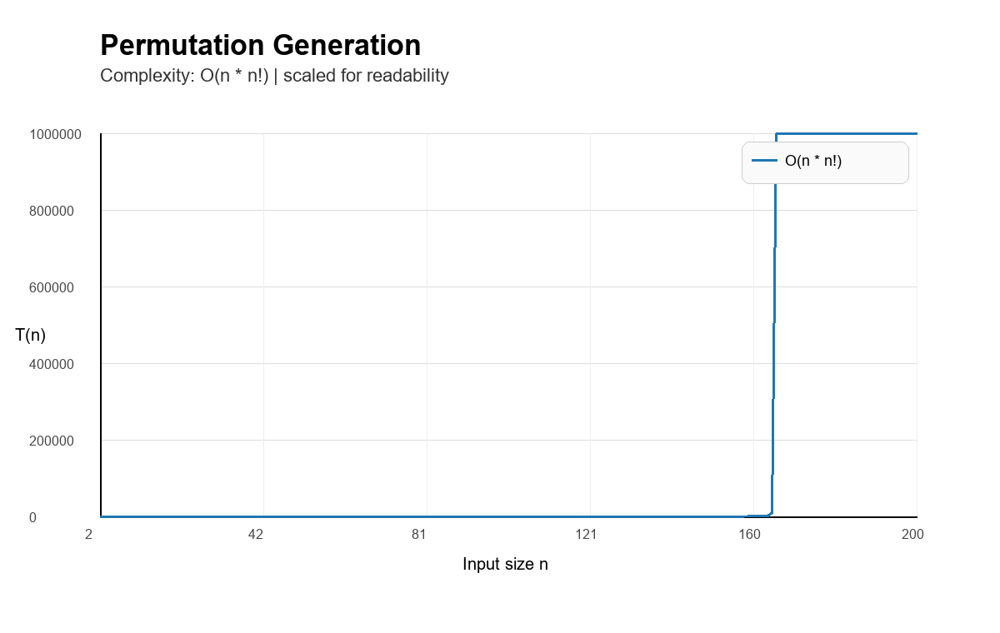

---

## **Practical 18: Quick Sort (Alternative Run)**

**Aim**
Sorts an array by recursive partitioning around a pivot.

**Algorithm**
1. Select a pivot element and separate smaller and larger values around it.
2. Fix the pivot in its correct sorted position.
3. Recursively sort both resulting subarrays.

**Time Complexity**
- `O(n log n) average, O(n^2) worst`

**Space Complexity**
- `O(log n) average recursion stack`

**Important Function Code**
```cpp
struct Pair {
    int first, second;
};

void swapVal(vector<int> &arr, int l, int h) {
    int t = arr[l];
    arr[l] = arr[h];
    arr[h] = t;
}

void qsi(vector<int> &arr) {
    stack<Pair> s;
    s.push({0, (int)arr.size()});

    while (!s.empty()) {
        Pair p = s.top();
        s.pop();

        int i = p.first;
        int j = p.second;

        if (i >= j) continue;

        int pivot = arr[i];

        do {
            do { i++; } while (i < arr.size() && arr[i] < pivot);
            do { j--; } while (j >= 0 && arr[j] > pivot);

            if (i < j) swapVal(arr, i, j);
            else swapVal(arr, p.first, j);

        } while (i < j);

        if (j - p.first + 1 > p.second - (j + 1)) {
            s.push({p.first, j});
            s.push({j + 1, p.second});
        } else {
            s.push({j + 1, p.second});
            s.push({p.first, j - 1});
        }
    }
}
```

**Use Cases**
- Sorting benchmark comparisons
- Divide-and-conquer practice
- Reusable quicksort experiments

**Graph Image**
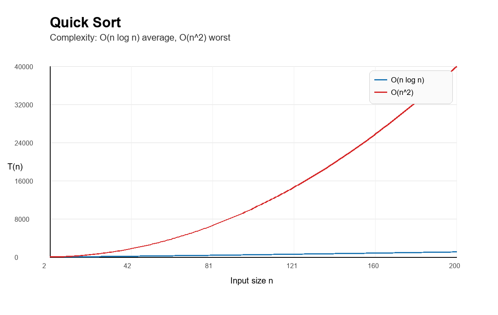

---

## **Practical 19: Convex Hull**

**Aim**
Computes the hull enclosing a set of planar points.

**Algorithm**
1. Sort the points so they can be processed in geometric order.
2. Build the boundary by keeping only turns that preserve the hull shape.
3. Combine the upper and lower boundaries to obtain the final convex hull.

**Time Complexity**
- `O(n log n)`

**Space Complexity**
- `O(n)`

**Important Function Code**
```cpp
vector<vector<int>> vertices;

int getDistance(vector<int> &a, vector<int> &b, vector<int> &c) {
    return (a[0]*(b[1]-c[1])) - (b[0]*(a[1]-c[1])) + (c[0]*(a[1]-b[1]));
}

vector<vector<int>> getLeftList(vector<int> &p1, vector<int> &p2, vector<vector<int>> &points) {
    vector<vector<int>> temp;

    for (auto &pt : points) {
        if (getDistance(p1, p2, pt) > 0) temp.push_back(pt);
    }

    return temp;
}

vector<int> getFarthest(vector<vector<int>> &points, vector<int> &p1, vector<int> &p2) {
    vector<int> far;
    int dist = 0;

    for (auto &pt : points) {
        int d = getDistance(p1, p2, pt);
        if (d > dist) {
            dist = d;
            far = pt;
        }
    }

    return far;
}

void solveRec(vector<int> &p1, vector<int> &p2, vector<vector<int>> &points) {
    if (points.empty()) return;

    vector<int> far = getFarthest(points, p1, p2);
    vertices.push_back(far);

    vector<vector<int>> left1 = getLeftList(p1, far, points);
    vector<vector<int>> left2 = getLeftList(far, p2, points);

    solveRec(p1, far, left1);
    solveRec(far, p2, left2);
}

vector<vector<int>> solve(vector<vector<int>> &points) {
    vertices.clear();

    vector<int> minX = points[0], maxX = points[0];

    for (auto &pt : points) {
        if (pt[0] < minX[0]) minX = pt;
        if (pt[0] > maxX[0]) maxX = pt;
    }

    vertices.push_back(minX);
    vertices.push_back(maxX);

    vector<vector<int>> left = getLeftList(minX, maxX, points);
    vector<vector<int>> right = getLeftList(maxX, minX, points);

    solveRec(minX, maxX, left);
    solveRec(maxX, minX, right);

    return vertices;
}
```

**Use Cases**
- Geometric boundary detection
- GIS and map preprocessing
- Shape analysis in graphics

**Graph Image**
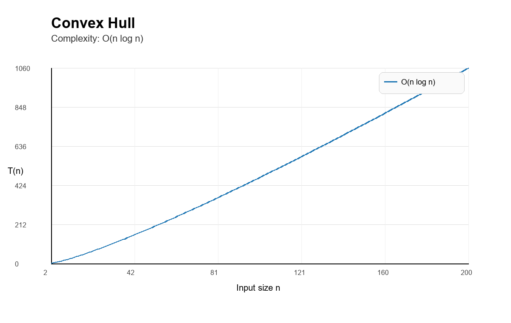

---

## **Practical 20: 0/1 Knapsack**

**Aim**
Maximizes value under capacity using dynamic programming.

**Algorithm**
1. Create DP states representing how much value can be achieved for each item and capacity.
2. For each item, compare taking it versus skipping it.
3. Use the best DP value at the end as the optimal answer.

**Time Complexity**
- `O(nW)`

**Space Complexity**
- `O(nW)`

**Important Function Code**
```cpp
double knapSack(vector<vector<int>> &m, int mw) {
    sort(m.begin(), m.end(), [](vector<int> &a, vector<int> &b) {
        return (double)b[0] / b[1] > (double)a[0] / a[1];
    });

    double total = 0.0;

    for (auto &item : m) {
        int value = item[0];
        int weight = item[1];

        if (mw >= weight) {
            total += value;
            mw -= weight;
        } else {
            total += ((double)value / weight) * mw;
            break;
        }
    }

    return total;
}
```

**Use Cases**
- Budget allocation problems
- Cargo or resource selection
- Decision optimization with capacity limits

**Graph Image**
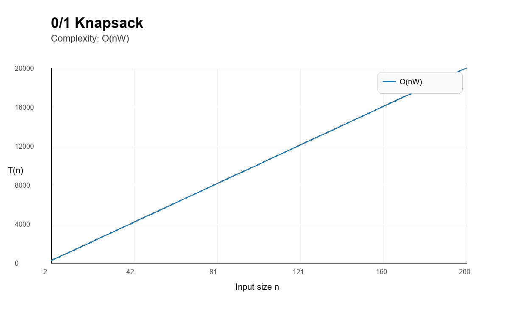

---

## **Practical 21: K-th Smallest**

**Aim**
Finds the k-th smallest element using a selection strategy.

**Algorithm**
1. Partition the array around a pivot value.
2. Determine whether the pivot position is before, after, or exactly at the desired rank.
3. Recurse only into the part of the array that can still contain the k-th smallest element.

**Time Complexity**
- `O(n) average with quickselect`

**Space Complexity**
- `O(log n) average recursion stack`

**Important Function Code**
```cpp
vector<vector<int>> vertices;

int getDistance(vector<int> &a, vector<int> &b, vector<int> &c) {
    return (a[0]*(b[1]-c[1])) - (b[0]*(a[1]-c[1])) + (c[0]*(a[1]-b[1]));
}

vector<vector<int>> getLeftList(vector<int> &p1, vector<int> &p2, vector<vector<int>> &points) {
    vector<vector<int>> temp;

    for (auto &pt : points) {
        if (getDistance(p1, p2, pt) > 0) temp.push_back(pt);
    }

    return temp;
}

vector<int> getFarthest(vector<vector<int>> &points, vector<int> &p1, vector<int> &p2) {
    vector<int> far;
    int dist = 0;

    for (auto &pt : points) {
        int d = getDistance(p1, p2, pt);
        if (d > dist) {
            dist = d;
            far = pt;
        }
    }

    return far;
}

void solveRec(vector<int> &p1, vector<int> &p2, vector<vector<int>> &points) {
    if (points.empty()) return;

    vector<int> far = getFarthest(points, p1, p2);
    vertices.push_back(far);

    vector<vector<int>> left1 = getLeftList(p1, far, points);
    vector<vector<int>> left2 = getLeftList(far, p2, points);

    solveRec(p1, far, left1);
    solveRec(far, p2, left2);
}

vector<vector<int>> solve(vector<vector<int>> &points) {
    vertices.clear();

    vector<int> minX = points[0], maxX = points[0];

    for (auto &pt : points) {
        if (pt[0] < minX[0]) minX = pt;
        if (pt[0] > maxX[0]) maxX = pt;
    }

    vertices.push_back(minX);
    vertices.push_back(maxX);

    vector<vector<int>> left = getLeftList(minX, maxX, points);
    vector<vector<int>> right = getLeftList(maxX, minX, points);

    solveRec(minX, maxX, left);
    solveRec(maxX, minX, right);

    return vertices;
}
```

**Use Cases**
- Median and percentile finding
- Order statistic queries
- Selection without full sorting

**Graph Image**
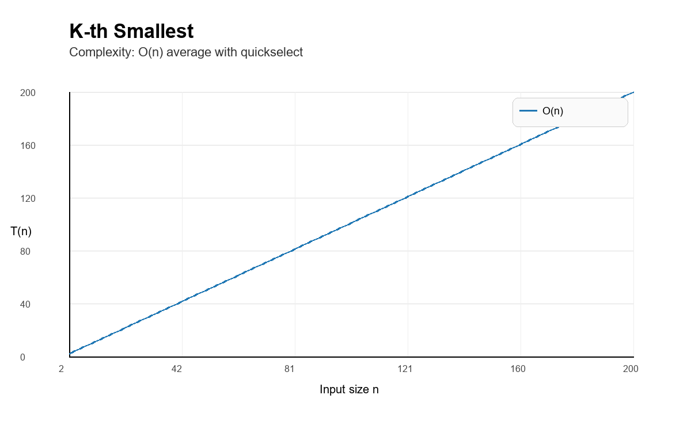

---

## **Practical 22: Max and Min**

**Aim**
Finds maximum and minimum elements efficiently.

**Algorithm**
1. Initialize current minimum and maximum values from the array.
2. Scan each remaining element once.
3. Update the stored minimum or maximum whenever a better candidate is found.

**Time Complexity**
- `O(n)`

**Space Complexity**
- `O(1)`

**Important Function Code**
```cpp
int mx = INT_MIN;
int mn = INT_MAX;

void max_min(vector<int> &arr, int s, int e) {
    if (s == e) {
        mx = mn = arr[s];
        return;
    }
    else if (e == s + 1) {
        if (arr[s] < arr[e]) {
            mn = arr[s];
            mx = arr[e];
        } else {
            mn = arr[e];
            mx = arr[s];
        }
        return;
    }

    int mid = s + (e - s) / 2;

    max_min(arr, s, mid);
    int leftMin = mn;
    int leftMax = mx;

    max_min(arr, mid + 1, e);
    int rightMin = mn;
    int rightMax = mx;

    mn = min(leftMin, rightMin);
    mx = max(leftMax, rightMax);
}
```

**Use Cases**
- Range summary statistics
- Preprocessing datasets
- Fast extrema lookup

**Graph Image**
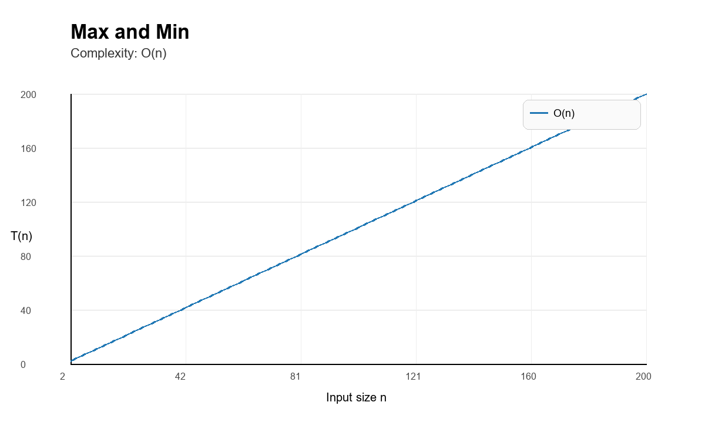

---

## **Practical 23: Quick Sort (Lab 5)**

**Aim**
Implements quick sort again for comparison and practice.

**Algorithm**
1. Choose a pivot and partition the array around it.
2. Place smaller elements on one side and larger ones on the other.
3. Recursively sort the two partitions.

**Time Complexity**
- `O(n log n) average, O(n^2) worst`

**Space Complexity**
- `O(log n) average recursion stack`

**Important Function Code**
```cpp
void swapIndex(vector<float> &arr, int l, int h) {
    float t = arr[l];
    arr[l] = arr[h];
    arr[h] = t;
}

int partition(vector<float> &arr, int s, int e) {
    int m = s + (e - s) / 2;
    float pivot = arr[m];

    int index = s;
    for (int i = s; i <= e; i++) {
        if (arr[i] < pivot) index++;
    }

    swapIndex(arr, m, index);

    int l = s, h = e;

    while (l < index && h > index) {
        while (arr[l] < pivot) l++;
        while (arr[h] > pivot) h--;

        if (l < index && h > index) {
            swapIndex(arr, l, h);
            l++;
            h--;
        }
    }

    return index;
}

void qs(vector<float> &arr, int s, int e) {
    if (s < e) {
        int j = partition(arr, s, e);
        qs(arr, s, j - 1);
        qs(arr, j + 1, e);
    }
}
```

**Use Cases**
- Comparing quicksort variants
- Repeated lab practice
- Sorting experimental data

**Graph Image**


---

## **Practical 24: Dijkstra's Algorithm**

**Aim**
Finds shortest paths from a source in a weighted graph.

**Algorithm**
1. Initialize all distances as infinity except the source vertex.
2. Repeatedly pick the unvisited vertex with the smallest tentative distance and relax its outgoing edges.
3. Continue until all reachable vertices have their shortest distances finalized.

**Time Complexity**
- `O((V+E) log V) with heap`

**Space Complexity**
- `O(V + E)`

**Important Function Code**
```cpp
const int INF = 1000000;

struct Pair {
    int node, dist;
};

void dijkstra(int s, vector<vector<int>> &g, vector<int> &d, int n) {
    vector<bool> vis(n, false);

    for (int i = 0; i < n; i++) d[i] = INF;

    d[s] = 0;

    priority_queue<pair<int,int>, vector<pair<int,int>>, greater<pair<int,int>>> pq;
    pq.push({0, s});

    while (!pq.empty()) {
        int u = pq.top().second;
        pq.pop();

        if (vis[u]) continue;
        vis[u] = true;

        for (int j = 0; j < n; j++) {
            if (!vis[j] && g[u][j] != INF) {
                if (d[j] > d[u] + g[u][j]) {
                    d[j] = d[u] + g[u][j];
                    pq.push({d[j], j});
                }
            }
        }
    }
}
```

**Use Cases**
- Road-network shortest paths
- Network routing
- Minimum-cost path planning

**Graph Image**
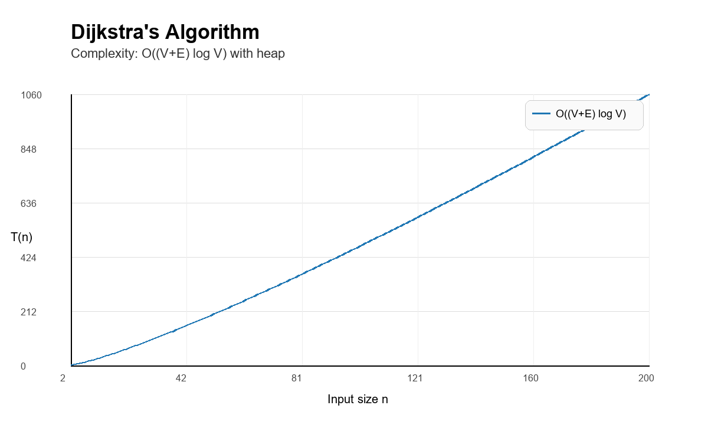

---

## **Practical 25: Kruskal's Algorithm**

**Aim**
Builds a minimum spanning tree using sorted edges and DSU.

**Algorithm**
1. Sort all edges in non-decreasing order of weight.
2. Process each edge and add it only if it connects two different components.
3. Stop once enough edges have been chosen to form the spanning tree.

**Time Complexity**
- `O(E log E)`

**Space Complexity**
- `O(V)`

**Important Function Code**
```cpp
struct Edge {
    int u, v, w;
};

vector<int> parent;

int findP(int x) {
    if (parent[x] < 0) return x;
    return parent[x] = findP(parent[x]);
}

void unite(int x, int y) {
    int px = findP(x);
    int py = findP(y);

    if (px == py) return;

    if (parent[px] < parent[py]) {
        parent[px] += parent[py];
        parent[py] = px;
    } else {
        parent[py] += parent[px];
        parent[px] = py;
    }
}

int kruskal(int n, vector<Edge> &edges) {
    sort(edges.begin(), edges.end(), [](Edge &a, Edge &b) {
        return a.w < b.w;
    });

    parent.assign(n, -1);

    int mincost = 0, count = 0;

    for (auto &e : edges) {
        int u = e.u, v = e.v;

        if (findP(u) != findP(v)) {
            unite(u, v);
            mincost += e.w;
            count++;

            cout << u << " - " << v << endl;

            if (count == n - 1) break;
        }
    }

    if (count != n - 1) {
        cout << "No Spanning Tree";
        return -1;
    }

    return mincost;
}
```

**Use Cases**
- Network design
- Cable or pipeline cost minimization
- Cluster construction from weighted graphs

**Graph Image**
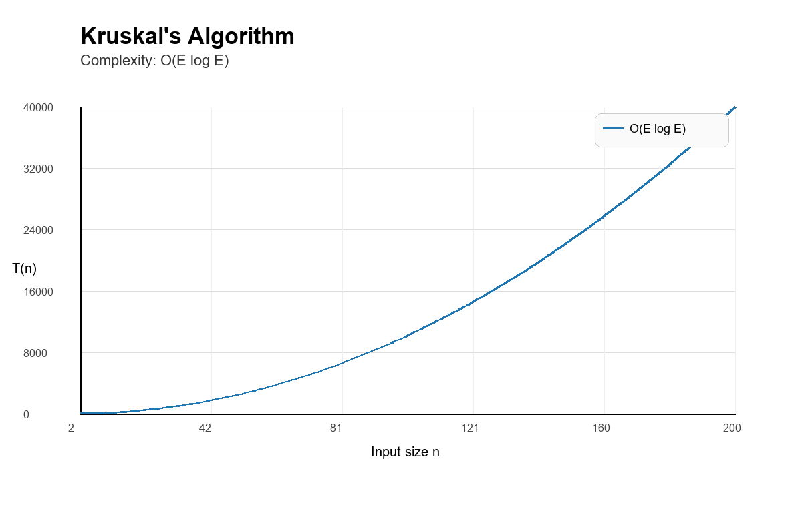

---

## **Practical 26: Prim's Algorithm**

**Aim**
Builds a minimum spanning tree by greedy expansion.

**Algorithm**
1. Start with one vertex already inside the tree.
2. Choose the cheapest edge that connects the current tree to a new vertex.
3. Repeat until every vertex becomes part of the spanning tree.

**Time Complexity**
- `O((V+E) log V) with heap`

**Space Complexity**
- `O(V)`

**Important Function Code**
```cpp
const int INF = 1000000;

int prims(vector<vector<int>> &cost, int n) {
    vector<int> near(n);
    vector<vector<int>> t(n - 1, vector<int>(2));
    int mincost = 0;

    int mn = INF, k = 0, l = 0;

    for (int i = 0; i < n; i++) {
        for (int j = i; j < n; j++) {
            if (cost[i][j] < mn) {
                mn = cost[i][j];
                k = i;
                l = j;
            }
        }
    }

    t[0][0] = k;
    t[0][1] = l;
    mincost = cost[k][l];

    for (int i = 0; i < n; i++) {
        if (cost[i][l] < cost[i][k]) near[i] = l;
        else near[i] = k;
    }

    near[k] = near[l] = 0;

    for (int i = 1; i < n - 1; i++) {
        int minVal = INF, j = -1;

        for (int v = 0; v < n; v++) {
            if (near[v] != 0 && cost[v][near[v]] < minVal) {
                minVal = cost[v][near[v]];
                j = v;
            }
        }

        if (j == -1) {
            cout << "Graph is disconnected";
            return -1;
        }

        t[i][0] = j;
        t[i][1] = near[j];
        mincost += cost[j][near[j]];

        near[j] = 0;

        for (int v = 0; v < n; v++) {
            if (near[v] != 0 && cost[v][near[v]] > cost[v][j]) {
                near[v] = j;
            }
        }
    }

    cout << "Edges in MST:" << endl;
    for (int i = 0; i < n - 1; i++) {
        cout << t[i][0] << " - " << t[i][1] << endl;
    }

    return mincost;
}
```

**Use Cases**
- Minimum wiring problems
- Campus or network design
- MST comparison with Kruskal

**Graph Image**
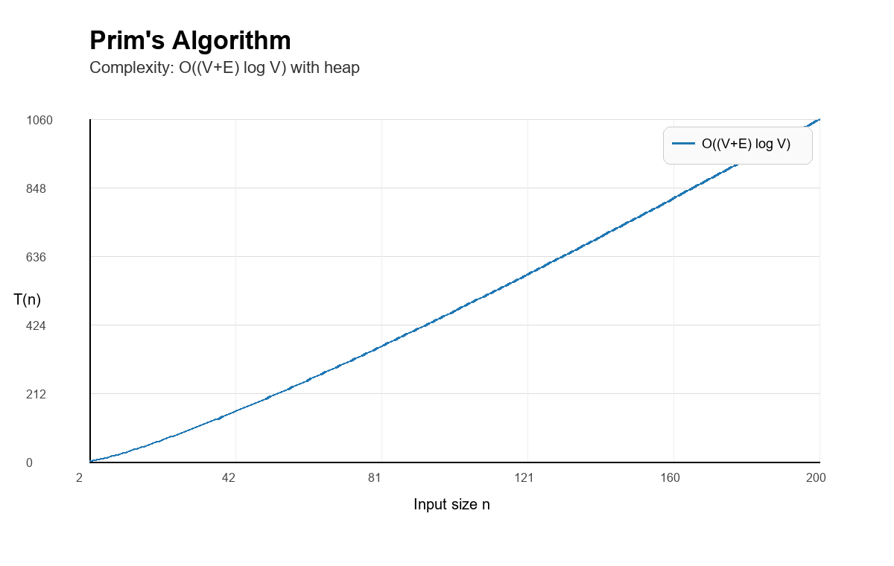

---

## **Practical 27: Stage Identification in a Multistage Graph**

**Aim**
Finds the stage sets of a directed multistage graph.

**Algorithm**
1. Begin from the source vertex and mark it as the first stage.
2. Explore all reachable next-level vertices that have not yet been assigned.
3. Group vertices stage by stage until no new stage can be formed.

**Time Complexity**
- `O(V^2)`

**Space Complexity**
- `O(V^2) for adjacency matrix`

**Important Function Code**
```cpp
const int INF = 10000000;
vector<set<int>> s;

void findStage(vector<vector<int>> &g) {
    s.clear();
    int n = g.size();
    vector<bool> visited(n, false);

    set<int> t;
    t.insert(0);
    visited[0] = true;
    s.push_back(t);

    int i = 0;

    while (i < s.size()) {
        set<int> st;
        for (int e : s[i]) {
            for (int j = 0; j < n; j++) {
                if (g[e][j] != 0 && g[e][j] != INF && !visited[j]) {
                    st.insert(j);
                    visited[j] = true;
                }
            }
        }
        if (!st.empty()) s.push_back(st);
        i++;
    }

    cout << "Number of stages = " << s.size() << endl;
}
```

**Use Cases**
- Preprocessing multistage graphs
- Visualizing layered DAG structures
- Planning pipeline stages

**Graph Image**


---

## **Practical 28: Multistage Graph Shortest Path**

**Aim**
Computes the minimum-cost path across stages in a multistage graph.

**Algorithm**
1. Identify the stage structure of the graph first.
2. Relax edges from one stage to the next while storing the cheapest cost and parent for each vertex.
3. Reconstruct the best path by tracing parents from the destination back to the source.

**Time Complexity**
- `O(V^2)`

**Space Complexity**
- `O(V^2) for adjacency matrix`

**Important Function Code**
```cpp
const int INF = 10000000;
vector<set<int>> s;

void findStage(vector<vector<int>> &g) {
    s.clear();
    int n = g.size();
    vector<bool> visited(n, false);

    set<int> t;
    t.insert(0);
    visited[0] = true;
    s.push_back(t);

    int i = 0;

    while (i < s.size()) {
        set<int> st;
        for (int e : s[i]) {
            for (int j = 0; j < n; j++) {
                if (g[e][j] != 0 && g[e][j] != INF && !visited[j]) {
                    st.insert(j);
                    visited[j] = true;
                }
            }
        }
        if (!st.empty()) s.push_back(st);
        i++;
    }
}

void bGraph(vector<vector<int>> &graph) {
    findStage(graph);

    int n = graph.size();
    int stages = s.size();

    vector<int> cost(n, INF);
    vector<int> parent(n, -1);

    cost[0] = 0;

    for (int i = 0; i < stages - 1; i++) {
        vector<int> curr(s[i].begin(), s[i].end());
        vector<int> next(s[i + 1].begin(), s[i + 1].end());

        for (int u : curr) {
            for (int v : next) {
                if (graph[u][v] != INF) {
                    if (cost[v] > cost[u] + graph[u][v]) {
                        cost[v] = cost[u] + graph[u][v];
                        parent[v] = u;
                    }
                }
            }
        }
    }


    vector<int> path(stages);
    int idx = stages - 1;
    int curr = n - 1;

    while (idx >= 0) {
        path[idx--] = curr;
        curr = parent[curr];
    }

    cout << "Minimum cost: " << cost[n - 1] << endl;
    cout << "Path: ";
    for (int i = 0; i < stages; i++) {
        cout << path[i] << " ";
    }
    cout << endl;
}
```

**Use Cases**
- Layered routing problems
- Project pipeline optimization
- Minimum-cost path in DAG-like stage graphs

**Graph Image**
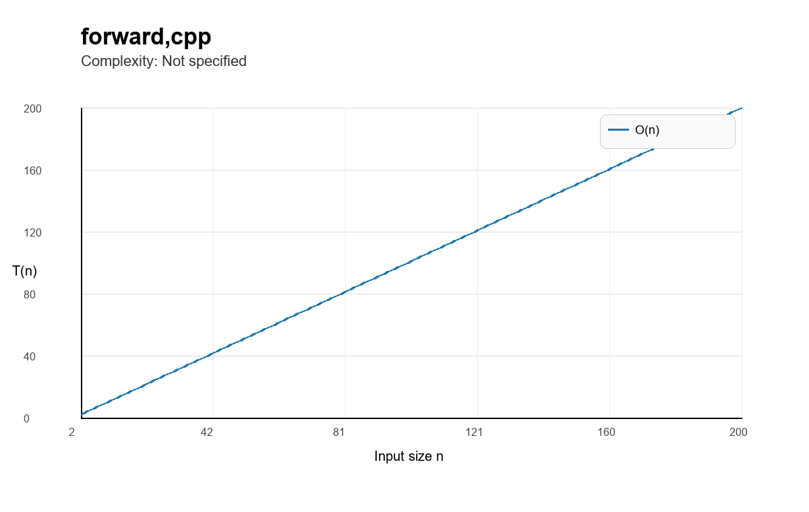

---

## **Practical 29: Matrix Chain Multiplication**

**Aim**
Finds the optimal parenthesization for matrix multiplication.

**Algorithm**
1. Consider matrix chains of increasing length.
2. Try every possible split point for each chain and compute the multiplication cost.
3. Store the best split so the minimum total scalar multiplications can be recovered later.

**Time Complexity**
- `O(n^3)`

**Space Complexity**
- `O(n^2)`

**Important Function Code**
```cpp
vector<vector<int>> m, s;

void matrixChainOrder(vector<int> &p) {
    int n = p.size() - 1;

    m.assign(n + 1, vector<int>(n + 1, 0));
    s.assign(n + 1, vector<int>(n + 1, 0));

    for (int i = 1; i <= n; i++) {
        m[i][i] = 0;
    }

    for (int l = 2; l <= n; l++) {
        for (int i = 1; i <= n - l + 1; i++) {
            int j = i + l - 1;
            m[i][j] = INT_MAX;

            for (int k = i; k < j; k++) {
                int q = m[i][k] + m[k + 1][j] + p[i - 1] * p[k] * p[j];

                if (q < m[i][j]) {
                    m[i][j] = q;
                    s[i][j] = k;
                }
            }
        }
    }
}

void printOptimalParens(int i, int j) {
    if (i == j) {
        cout << "A" << i;
    } else {
        cout << "(";
        printOptimalParens(i, s[i][j]);
        printOptimalParens(s[i][j] + 1, j);
        cout << ")";
    }
}

double timeCalc(vector<int> &p) {
    auto t1 = chrono::high_resolution_clock::now();
    matrixChainOrder(p);
    auto t2 = chrono::high_resolution_clock::now();

    return chrono::duration<double, milli>(t2 - t1).count();
}

vector<int> generateDimensions(int n) {
    vector<int> p(n + 1);

    for (int i = 0; i <= n; i++) {
        p[i] = rand() % 50 + 1; // avoid 0
    }

    return p;
}
```

**Use Cases**
- Query-plan optimization
- Linear algebra operation planning
- Dynamic programming demonstrations

**Graph Image**
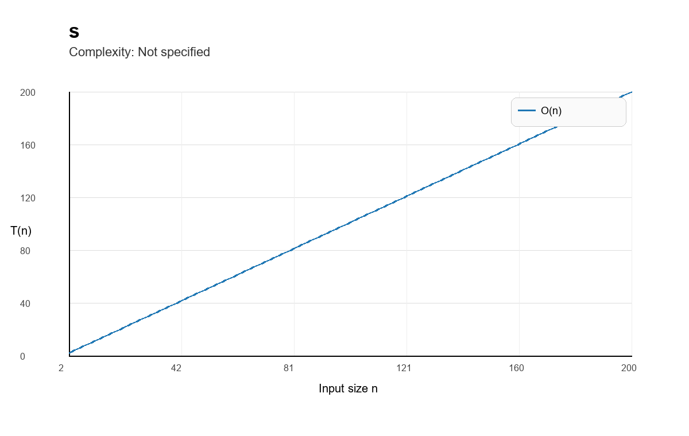

---

## **Practical 30: All-Pairs Shortest Path**

**Aim**
Computes shortest paths between every pair of vertices.

**Algorithm**
1. Initialize the distance matrix from the given graph.
2. Use each vertex one by one as an intermediate stopping point.
3. Update pairwise distances whenever going through that intermediate vertex gives a shorter route.

**Time Complexity**
- `O(V^3)`

**Space Complexity**
- `O(V^2)`

**Important Function Code**
```cpp
const int INF = numeric_limits<int>::max();

void floydWarshall(vector<vector<int>>& dist, int V) {
    for (int k = 0; k < V; k++) {
        for (int i = 0; i < V; i++) {
            for (int j = 0; j < V; j++) {
                if (dist[i][k] != INF && dist[k][j] != INF && dist[i][k] + dist[k][j] < dist[i][j]) {
                    dist[i][j] = dist[i][k] + dist[k][j];
                }
            }
        }
    }
}
```

**Use Cases**
- Transit cost tables
- Network latency matrices
- Dense-graph shortest path analysis

**Graph Image**
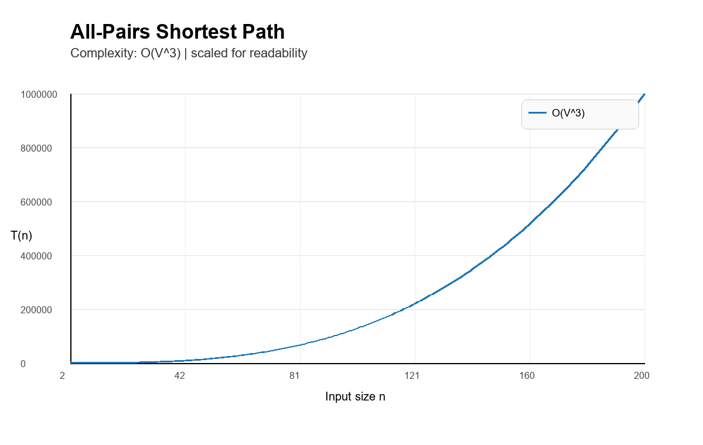

---

## **Practical 31: Floyd-Warshall Timing Variant**

**Aim**
Benchmarks all-pairs shortest path on generated graphs.

**Algorithm**
1. Generate or initialize a weighted graph matrix.
2. Run Floyd-Warshall by improving distances through every possible intermediate vertex.
3. Measure the execution time over multiple runs to study growth behavior.

**Time Complexity**
- `O(V^3)`

**Space Complexity**
- `O(V^2)`

**Important Function Code**
```cpp
const int INF = 1000000;

void floydWarshall(vector<vector<int>> &cost, vector<vector<int>> &A, int n) {
  
    for (int i = 0; i < n; i++) {
        for (int j = 0; j < n; j++) {
            A[i][j] = cost[i][j];
        }
    }

    for (int k = 0; k < n; k++) {
        for (int i = 0; i < n; i++) {
            for (int j = 0; j < n; j++) {
                if (A[i][j] > A[i][k] + A[k][j]) {
                    A[i][j] = A[i][k] + A[k][j];
                }
            }
        }
    }
}

double timeCalc(vector<vector<int>> &graph) {
    int n = graph.size();
    vector<vector<int>> A(n, vector<int>(n));

    auto t1 = chrono::high_resolution_clock::now();
    floydWarshall(graph, A, n);
    auto t2 = chrono::high_resolution_clock::now();

    return chrono::duration<double, milli>(t2 - t1).count();
}

vector<vector<int>> generateGraph(int n) {
    vector<vector<int>> g(n, vector<int>(n));

    for (int i = 0; i < n; i++) {
        for (int j = 0; j < n; j++) {
            if (i == j) g[i][j] = 0;
            else {
                double prob = (double)rand() / RAND_MAX;
                if (prob < 0.4)
                    g[i][j] = rand() % 50 + 1;
                else
                    g[i][j] = INF;
            }
        }
    }
    return g;
}
```

**Use Cases**
- Performance measurement of APSP
- Synthetic graph experiments
- Algorithm growth visualization

**Graph Image**
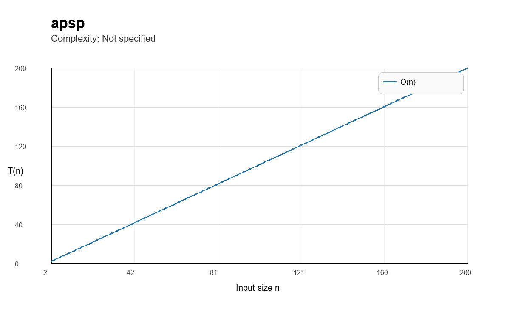

---

## **Practical 32: Traveling Salesman Problem**

**Aim**
Finds the minimum Hamiltonian tour cost using dynamic programming.

**Algorithm**
1. Represent visited cities using subset masks.
2. Store the best cost to reach each city with each visited subset.
3. Combine smaller subsets into larger ones until the minimum complete tour is obtained.

**Time Complexity**
- `Exponential / O(n^2 * 2^n)`

**Space Complexity**
- `O(n * 2^n)`

**Important Function Code**
```cpp
class TSP {
public:

    // 🔹 BACKTRACKING APPROACH
    class Backtracking {
    public:
        int DFS(vector<bool> &vis, vector<vector<int>> &cost, int curr, int count) {
            int n = cost.size();

            if (count == n)
                return cost[curr][0];

            int mn = INT_MAX;

            for (int i = 1; i < n; i++) {
                if (!vis[i]) {
                    vis[i] = true;
                    mn = min(mn, cost[curr][i] + DFS(vis, cost, i, count + 1));
                    vis[i] = false;
                }
            }
            return mn;
        }

        int tsp(vector<vector<int>> &cost) {
            int n = cost.size();
            vector<bool> vis(n, false);
            vis[0] = true;
            return DFS(vis, cost, 0, 1);
        }
    };

    // 🔹 DP (BITMASKING APPROACH)
    class DP {
    public:
        static const int INF = INT_MAX;

        int tsp(int n, vector<vector<int>> &cost) {
            int VISITED_ALL = 1 << n;

            vector<vector<int>> dp(VISITED_ALL, vector<int>(n, INF));

            dp[1][0] = 0; // start from city 0

            for (int mask = 1; mask < VISITED_ALL; mask++) {
                for (int u = 0; u < n; u++) {

                    if (!(mask & (1 << u))) continue;

                    for (int v = 0; v < n; v++) {

                        if (mask & (1 << v)) continue;

                        int newMask = mask | (1 << v);

                        dp[newMask][v] = min(
                            dp[newMask][v],
                            dp[mask][u] + cost[u][v]
                        );
                    }
                }
            }

            int ans = INF;

            for (int i = 0; i < n; i++) {
                ans = min(ans, dp[VISITED_ALL - 1][i] + cost[i][0]);
            }

            return ans;
        }
    };
};
```

**Use Cases**
- Route optimization
- Tour planning with exact solutions
- Bitmask dynamic programming practice

**Graph Image**
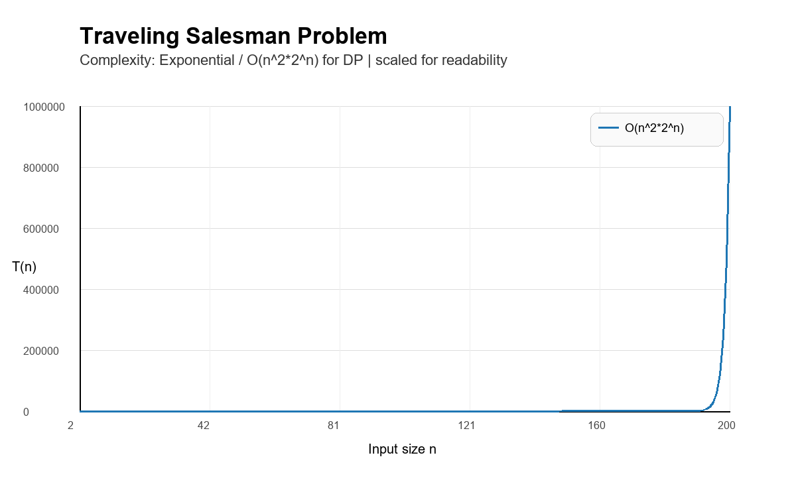

---

## **Practical 33: Graph Coloring**

**Aim**
Assigns valid colors to graph vertices using backtracking.

**Algorithm**
1. Assign a color to the current vertex from the available choices.
2. Check whether the assignment is safe with respect to adjacent vertices.
3. If a conflict appears, backtrack and try the next color.

**Time Complexity**
- `Exponential (backtracking)`

**Space Complexity**
- `O(V) recursion stack`

**Important Function Code**
```cpp
bool isSafe(int v, int c, vector<vector<int>> &graph, vector<int> &color, int n) {
    for (int i = 0; i < n; i++) {
        if (graph[v][i] == 1 && color[i] == c)
            return false;
    }
    return true;
}

void solve(int v, vector<vector<int>> &graph, vector<int> &color, int n, int m) {
    if (v == n) {
        for (int i = 0; i < n; i++)
            cout << color[i] << " ";
        cout << endl;
        return;
    }

    for (int c = 1; c <= m; c++) {
        if (isSafe(v, c, graph, color, n)) {
            color[v] = c;
            solve(v + 1, graph, color, n, m);
            color[v] = 0; // backtrack
        }
    }
}
```

**Use Cases**
- Timetable scheduling
- Register allocation concepts
- Constraint satisfaction practice

**Graph Image**
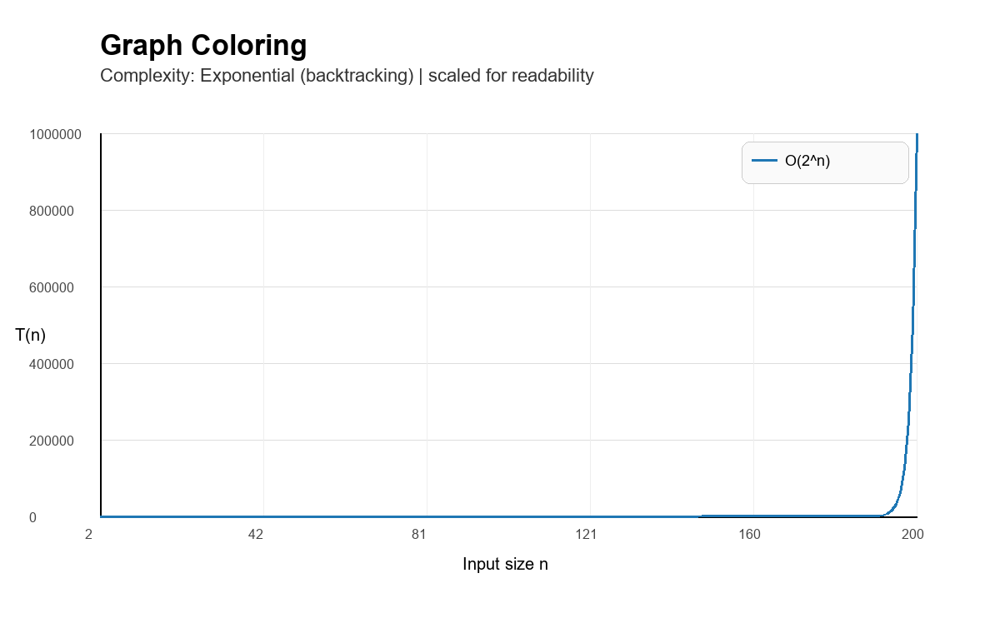

---

## **Practical 34: Hamiltonian Cycle**

**Aim**
Finds a cycle that visits every vertex exactly once.

**Algorithm**
1. Start building the cycle from a chosen source vertex.
2. Add the next valid vertex that has not already appeared in the path.
3. Backtrack whenever the partial path cannot be extended into a full Hamiltonian cycle.

**Time Complexity**
- `Exponential (backtracking)`

**Space Complexity**
- `O(V) recursion stack`

**Important Function Code**
```cpp
void nextValue(int k, vector<vector<int>> &graph, vector<int> &x, int n) {
    while (true) {
        x[k] = (x[k] + 1) % n;

        if (x[k] == 0) return;

        // Check if edge exists
        if (graph[x[k - 1]][x[k]] == 1) {
            int j;
            for (j = 0; j < k; j++) {
                if (x[j] == x[k]) break;
            }

            // If not already included
            if (j == k) {
                // If not last vertex OR last vertex connects to first
                if (k < n - 1 || (k == n - 1 && graph[x[k]][x[0]] == 1)) {
                    return;
                }
            }
        }
    }
}

void hamiltonian(int k, vector<vector<int>> &graph, vector<int> &x, int n) {
    while (true) {
        nextValue(k, graph, x, n);

        if (x[k] == 0) return;

        if (k == n - 1) {
            for (int i = 0; i < n; i++)
                cout << x[i] << " ";
            cout << x[0] << endl; // complete cycle
        } else {
            hamiltonian(k + 1, graph, x, n);
        }
    }
}
```

**Use Cases**
- Route feasibility checks
- Graph traversal puzzles
- Backtracking demonstrations

**Graph Image**
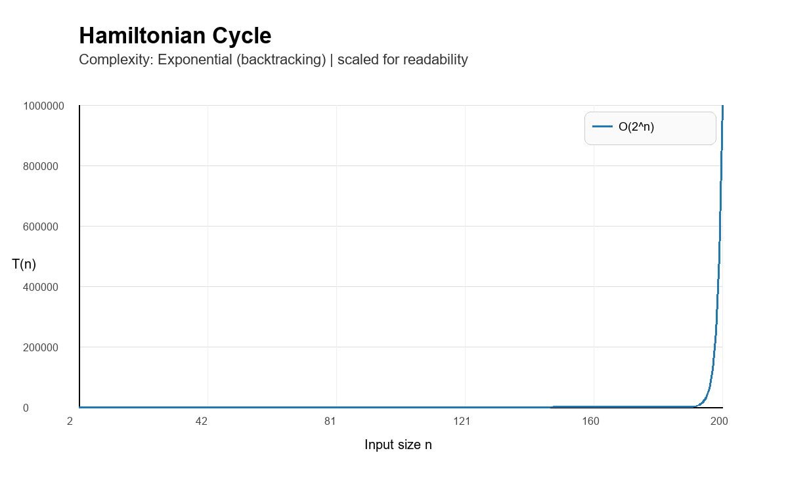

---

## **Practical 35: N-Queens**

**Aim**
Places N queens on a board so none attack each other.

**Algorithm**
1. Place one queen row by row.
2. Check columns and diagonals before accepting each placement.
3. Backtrack whenever a row has no safe position left.

**Time Complexity**
- `Exponential (backtracking)`

**Space Complexity**
- `O(N) recursion stack`

**Important Function Code**
```cpp
int solutions;

bool isSafe(int k, int i, vector<int> &x) {
    for (int j = 0; j < k; j++) {
        if (x[j] == i || abs(x[j] - i) == abs(j - k)) {
            return false;
        }
    }
    return true;
}

void solve(int k, vector<int> &x, int n) {
    if (k == n) {
        solutions++;
        return;
    }

    for (int i = 0; i < n; i++) {
        if (isSafe(k, i, x)) {
            x[k] = i;
            solve(k + 1, x, n);
        }
    }
}

double timeCalc(int n) {
    vector<int> x(n, 0);
    solutions = 0;

    auto t1 = chrono::high_resolution_clock::now();
    solve(0, x, n);
    auto t2 = chrono::high_resolution_clock::now();

    return chrono::duration<double, milli>(t2 - t1).count();
}
```

**Use Cases**
- Constraint-solving practice
- Chessboard puzzle solving
- Backtracking visualization

**Graph Image**
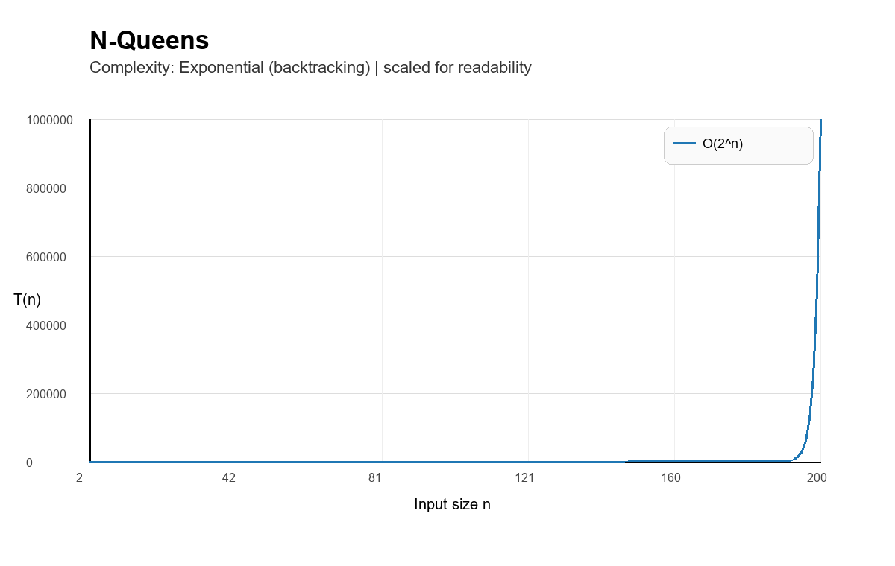

---

## **Practical 36: Sum of Subsets**

**Aim**
Finds subsets whose sum matches a target value.

**Algorithm**
1. At each step, decide whether to include or exclude the current element.
2. Track the running sum to see whether the target can still be reached.
3. Backtrack whenever the partial selection cannot produce a valid solution.

**Time Complexity**
- `Exponential`

**Space Complexity**
- `O(n) recursion stack`

**Important Function Code**
```cpp
int countSol;

void sumOfSubsets(int s, int k, int r, vector<int> &w, vector<int> &x, int n, int W) {
    if (k < n) {
        x[k] = 1;

        if (s + w[k] == W) {
            countSol++;
        }
        else if (k + 1 < n && s + w[k] + w[k + 1] <= W) {
            sumOfSubsets(s + w[k], k + 1, r - w[k], w, x, n, W);
        }

        if (k + 1 < n && s + r - w[k] >= W && s + w[k + 1] <= W) {
            x[k] = 0;
            sumOfSubsets(s, k + 1, r - w[k], w, x, n, W);
        }
    }
}

double timeCalc(vector<int> &w, int W) {
    int n = w.size();
    vector<int> x(n, 0);
    countSol = 0;

    int r = 0;
    for (int val : w) r += val;

    auto t1 = chrono::high_resolution_clock::now();
    sumOfSubsets(0, 0, r, w, x, n, W);
    auto t2 = chrono::high_resolution_clock::now();

    return chrono::duration<double, milli>(t2 - t1).count();
}

vector<int> generateSet(int n) {
    vector<int> w(n);

    for (int i = 0; i < n; i++) {
        w[i] = rand() % 10 + 1;
    }

    sort(w.begin(), w.end());
    return w;
}
```

**Use Cases**
- Subset-sum decision problems
- Budget combination search
- Backtracking with pruning

**Graph Image**
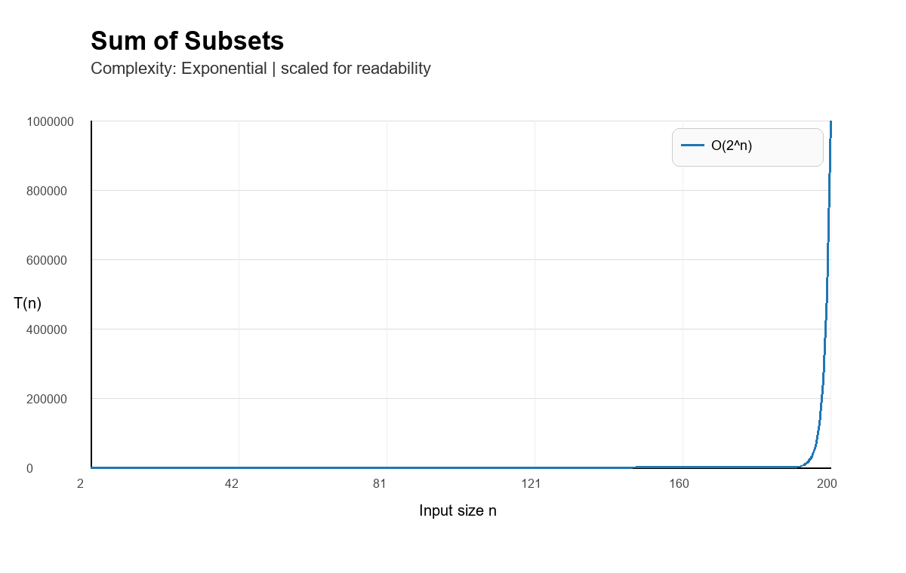

---
